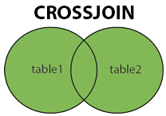

# STEP 1
```SELECT CustomerName,City,Country FROM customers;```

# STEP 2
```SELECT DISTINCT Country FROM customers;```

# STEP 3 
```SELECT COUNT(Country) FROM customers;```

# STEP 4
```SELECT COUNT(DISTINCT Country) FROM customers;```

# STEP 5
```SELECT * FROM customers WHERE Country='Rwanda';```

# STEP 6
```SELECT * FROM customers WHERE CustomerID=3;```

# STEP 7
```SELECT * FROM products WHERE price=56;```

# STEP 8
```SELECT * FROM products WHERE price > 30;```

# STEP 9
```SELECT * FROM products WHERE price < 30;```

# STEP 10
```SELECT * FROM products WHERE price >= 30;```

# STEP 11
```SELECT * FROM products WHERE price >= 30;```

# STEP 12
```SELECT * FROM products WHERE price <= 30;```

# STEP 13
```SELECT * FROM products WHERE price <> 30;```

# STEP 14
```SELECT * FROM products WHERE price BETWEEN 50 AND 60;```

# STEP 15
```SELECT * FROM customers WHERE City LIKE 's%';```

# STEP 16
```
SELECT * FROM customers WHERE City IN ('West Alanna', 'North Hershel');
```
# STEP 17 MySQL AND, OR and NOT Operators
```
SELECT * FROM customers 
WHERE Country = 'Fiji' AND City = 'Gusikowskiville';
```

# STEP 18 
```
SELECT * FROM customers 
WHERE City = 'Feestview' OR City = 'Welchview';
```

# STEP 19
```
SELECT * FROM customers 
WHERE Country = 'Rwanda' OR Country = 'Bulgaria';
```

# STEP 20
```SELECT * FROM customers WHERE NOT Country = 'Rwanda';```

# STEP 21
```
SELECT  * FROM customers WHERE Country = 'Bulgaria' 
AND (City ='West Isaiah' OR City = 'Feestview');
```
# STEP 22
```
SELECT * FROM customers WHERE NOT Country = 'Rwanda' 
AND NOT Country ='Bulgaria';
```
# STEP 23 MySQL ORDER BY Keyword
```SELECT * FROM customers ORDER BY Country;```

# STEP 24
```SELECT * FROM customers ORDER BY Country DESC;```
# STEP 25

```SELECT * FROM customers ORDER BY Country, CustomerName;```

# STEP 26
```SELECT * FROM customers ORDER BY Country ASC, CustomerName DESC;```
# STEP 27 The MySQL INSERT INTO Statement
```
INSERT INTO customers 
(CustomerName, ContactName, Address, City, PostalCode, Country)
VALUES 
('Cardinal','Tom B. Erichsen', 'Skagen 21','Stavanger','4006','Norway');
```
# STEP 28 MySQL NULL Values
```
SELECT CustomerName, ContactName, Address 
FROM customers
WHERE Address IS NULL;
```
# STEP 29
```
SELECT CustomerName, ContactName, Address 
FROM customers
WHERE Address IS NOT NULL;
```
# STEP 30 MySQL UPDATE Statement
```
UPDATE customers
SET ContactName = 'Alfred Schmidt', City = 'Nadi'
WHERE CustomerID = 1;
```
# STEP 31
```
UPDATE customers
SET PostalCode = '0000'
WHERE Country = 'Ukraine';
```
# STEP 32 MySQL DELETE Statement
```DELETE FROM customers WHERE CustomerName = 'Ellie Runte';```
# STEP 33 MySQL LIMIT Clause
```SELECT * FROM customers LIMIT 3;```
# STEP 34
```SELECT * FROM customers WHERE Country = 'Bulgaria' LIMIT 2;```
# STEP 35 MySQL MIN() and MAX() Functions
```SELECT MIN(Price) AS SmallestPrice FROM products;```
# STEP 36
```SELECT MAX(Price) AS LargestPrice FROM products;```
# STEP 37 MySQL COUNT(), AVG() and SUM() Functions
```SELECT COUNT(ProductID) FROM products;```
# STEP 38 
```SELECT AVG(Price) FROM products;```
# STEP 39
```SELECT SUM(Quantity) FROM order_details;```
# STEP 40 MySQL LIKE Operator The following SQL statement selects all customers with a CustomerName starting with "a":
```SELECT * FROM customers WHERE CustomerName LIKE 'a%';```
# STEP 41 The following SQL statement selects all customers with a CustomerName ending with "a":
```SELECT * FROM customers WHERE CustomerName LIKE '%a';```
# STEP 42 The following SQL statement selects all customers with a CustomerName that have "or" in any position:
```SELECT * FROM customers WHERE CustomerName LIKE '%or%';```
# STEP 43 The following SQL statement selects all customers with a CustomerName that have "r" in the second position:
```SELECT * FROM customers WHERE CustomerName LIKE '_r%';```
# STEP 44 The following SQL statement selects all customers with a CustomerName that starts with "a" and are at least 3 characters in length:
```SELECT * FROM customers WHERE CustomerName LIKE 'a__%';```
# STEP 45 The following SQL statement selects all customers with a ContactName that starts with "a" and ends with "s":
```SELECT * FROM customers WHERE CustomerName LIKE 'a%s';```
# STEP 46 The following SQL statement selects all customers with a CustomerName that does NOT start with "a":
```SELECT * FROM customers WHERE CustomerName NOT LIKE 'a%';```
# STEP 47 MySQL Wildcards 
# The following SQL statement selects all customers with a City starting with "la":
```SELECT * FROM customers WHERE City LIKE 'la%';```
# STEP 48 The following SQL statement selects all customers with a City containing the pattern "es": 
```SELECT * FROM customers WHERE City LIKE '%es%';```
# STEP 49 The following SQL statement selects all customers with a City starting with any character, followed by "_adi":
```SELECT * FROM customers WHERE City LIKE '_adi';```
# STEP 50 The following SQL statement selects all customers with a City starting with "R", followed by any character, followed by "w", followed by any character, followed by "side": Roweside
```SELECT * FROM customers WHERE City LIKE 'R_w_side';```
# STEP 51 MySQL IN Operator
# The following SQL statement selects all customers that are located in "Bulgaria", "Rwanda" or "Moldova":
```
SELECT * FROM customers WHERE Country IN ('Bulgaria', 'Rwanda', 'Moldova');
```
# STEP 52  The following SQL statement selects all customers that are NOT located in "Bulgaria", "Rwanda" or "Moldova":
```
SELECT * FROM customers WHERE Country NOT IN ('Bulgaria', 'Rwanda', 'Moldova');
```
# STEP 53 The following SQL statement selects all customers that are from the same countries as the table suppliers:
```
SELECT * FROM customers WHERE Country IN (SELECT Country FROM suppliers);
```
# STEP 54 MySQL BETWEEN Operator
## The following SQL statement selects all products with a price between 10 and 80:
```
SELECT * FROM products WHERE Price BETWEEN 10 AND 80;
```
# STEP 55 To display the products outside the range of the previous example, use NOT BETWEEN:
```
SELECT * FROM products WHERE Price NOT BETWEEN 10 AND 80;
```
# STEP 56 The following SQL statement selects all products with a price between 10 and 20. In addition; do not show products with a CategoryID of 1,2, or 3:
```
SELECT * FROM products WHERE Price BETWEEN 10 AND 80 AND CategoryID NOT IN (1,2,3);
```
# STEP 57 The following SQL statement selects all products with a ProductName between "Libero nesciunt quisquam" and "Voluptas enim libero eos":
```
SELECT * FROM products WHERE ProductName 
BETWEEN 'Libero nesciunt quisquam' AND 'Voluptas enim libero eos'
ORDER BY ProductName;
```
# STEP 58 The following SQL statement selects all products with a ProductName between "Corporis nulla et" and "Quia repellat":
```
SELECT * FROM products WHERE ProductName 
BETWEEN 'Corporis nulla et' AND 'Quia repellat'
ORDER BY ProductName;
```
# STEP 59 The following SQL statement selects all products with a ProductName not between "Nobis dolorem ab deleniti" and "Dolor sunt eos":
```
SELECT * FROM products WHERE ProductName NOT
BETWEEN 'Nobis dolorem ab deleniti' AND 'Dolor sunt eos'
ORDER BY ProductName;
```
# STEP 60 The following SQL statement selects all orders with an OrderDate between '01-July-1996' and '31-July-1996':
```
SELECT * FROM orders WHERE OrderDate BETWEEN '1996-07-01' AND '2011-07-01';
```
# STEP 61 MySQL Aliases
## The following SQL statement creates two aliases, one for the CustomerID column and one for the CustomerName column:
```
SELECT CustomerID AS ID, CustomerName AS Customer FROM customers;
```
# STEP 62 The following SQL statement creates two aliases, one for the CustomerName column and one for the ContactName column. Note: Single or double quotation marks are required if the alias name contains spaces:
```
SELECT CustomerName AS Customer, ContactName AS "Contact Person" FROM customers;
```
# STEP 63 The following SQL statement creates an alias named "Address" that combine four columns (Address, PostalCode, City and Country):
```
SELECT CustomerName, CONCAT_WS(', ', Address, Postalcode, City, Country) AS Address FROM customers;
```
# STEP 64 The following SQL statement selects all the orders from the customer with CustomerID=4 (Around the Horn). We use the "Customers" and "Orders" tables, and give them the table aliases of "c" and "o" respectively (Here we use aliases to make the SQL shorter):
```
SELECT o.OrderID, o.OrderDate, c.CustomerName
FROM customers AS c, orders AS o
WHERE c.CustomerName='Sharon Rice' AND c.CustomerID=o.CustomerID;
```
# STEP 65 The following SQL statement is the same as above, but without aliases:
```
SELECT Orders.OrderID, Orders.OrderDate, Customers.CustomerName
FROM Customers, Orders
WHERE Customers.CustomerName='Sharon Rice' AND Customers.CustomerID=Orders.CustomerID;
```
# STEP 66 MySQL Joins
# Then, we can create the following SQL statement (that contains an INNER JOIN), that selects records that have matching values in both tables:
```
SELECT orders.OrderID, customers.CustomerName, orders.OrderDate
FROM orders
INNER JOIN customers ON orders.CustomerID=customers.CustomerID;
```
# STEP 67 Supported Types of Joins in MySQL
- INNER JOIN: Returns records that have matching values in both tables
- LEFT JOIN: Returns all records from the left table, and the matched records from the right table
- RIGHT JOIN: Returns all records from the right table, and the matched records from the left table
- CROSS JOIN: Returns all records from both tables
# STEP 68

<p>
<!-- <image src="public/images/img_innerjoin.gif" alt="Текст с описанием картинки"> -->



</p>

# STEP 69 MySQL INNER JOIN Keyword
### The INNER JOIN keyword selects records that have matching values in both tables.
<p style="text-align:center;">

</p>

# STEP 70 The following SQL statement selects all orders with customer information:
#### Note: The INNER JOIN keyword selects all rows from both tables as long as there is a match between the columns. If there are records in the "Orders" table that do not have matches in "Customers", these orders will not be shown!
```
SELECT Orders.OrderID, Customers.CustomerName
FROM Orders
INNER JOIN Customers ON Orders.CustomerID = Customers.CustomerID;
```
# STEP 71 JOIN Three Tables
### The following SQL statement selects all orders with customer and shipper information:
```
SELECT orders.OrderID, customers.CustomerName, shippers.ShipperName
FROM ((orders 
INNER JOIN customers ON orders.CustomerID = customers.CustomerID)
INNER JOIN shippers ON orders.ShipperID = shippers.ShipperID); 
```
# STEP 72 MySQL LEFT JOIN Keyword
### The LEFT JOIN keyword returns all records from the left table (table1), and the matching records (if any) from the right table (table2).
<p style="text-align:center;">

</p>

# STEP 73 The following SQL statement will select all customers, and any orders they might have:
```
SELECT customers.CustomerName, orders.OrderID
FROM customers
LEFT JOIN orders ON customers.CustomerID = orders.CustomerID
ORDER BY customers.CustomerName;
```
# STEP 74 MySQL RIGHT JOIN Keyword
### The RIGHT JOIN keyword returns all records from the right table (table2), and the matching records (if any) from the left table (table1).
<p style="text-align:center;">

</p>

# STEP 75 The following SQL statement will return all employees, and any orders they might have placed:
### Note: The RIGHT JOIN keyword returns all records from the right table (Employees), even if there are no matches in the left table (Orders).
```
SELECT orders.OrderID, employees.LastName, employees.FirstName
FROM orders
RIGHT JOIN employees ON orders.EmployeeID = employees.EmployeeID
ORDER BY orders.OrderID;
```
# STEP 76 MySQL CROSS JOIN Keyword
### The CROSS JOIN keyword returns all records from both tables (table1 and table2).
<p style="text-align:center;">

</p>

### Note: CROSS JOIN can potentially return very large result-sets!

# STEP 77 The following SQL statement selects all customers, and all orders:
```
SELECT customers.CustomerName, orders.OrderID
FROM customers
CROSS JOIN orders;
```
### Note: The CROSS JOIN keyword returns all matching records from both tables whether the other table matches or not. So, if there are rows in "Customers" that do not have matches in "Orders", or if there are rows in "Orders" that do not have matches in "Customers", those rows will be listed as well.
# STEP 78 If you add a WHERE clause (if table1 and table2 has a relationship), the CROSS JOIN will produce the same result as the INNER JOIN clause:
```
SELECT customers.CustomerName, orders.OrderID
FROM customers
CROSS JOIN orders
WHERE customers.CustomerID = orders.CustomerID;
```
# STEP 79 MySQL Self Join
### A self join is a regular join, but the table is joined with itself.
# The following SQL statement matches customers that are from the same city:
```
SELECT A.CustomerName AS CustomerName1, B.CustomerName AS CustomerName2, A.City
FROM customers A, customers B
WHERE A.CustomerID <> B.CustomerID
AND A.City = B.City
ORDER BY A.City;
```
# STEP 80 MySQL UNION Operator
### The UNION operator is used to combine the result-set of two or more SELECT statements.
- Every SELECT statement within UNION must have the same number of columns
- The columns must also have similar data types
- The columns in every SELECT statement must also be in the same order

### The UNION operator selects only distinct values by default. To allow duplicate values, use UNION ALL
### Note: The column names in the result-set are usually equal to the column names in the first SELECT statement.
# STEP 81 The following SQL statement returns the cities (only distinct values) from both the "Customers" and the "Suppliers" table:
```
SELECT City FROM customers
UNION
SELECT City FROM suppliers
ORDER BY City;
```
### Note: If some customers or suppliers have the same city, each city will only be listed once, because UNION selects only distinct values. Use UNION ALL to also select duplicate values!
# STEP 82 The following SQL statement returns the cities (duplicate values also) from both the "Customers" and the "Suppliers" table:
```
SELECT City FROM customers
UNION ALL
SELECT City FROM suppliers
ORDER BY City;
```
# STEP 83 SQL UNION With WHERE
### The following SQL statement returns the Bulgaria cities (only distinct values) from both the "Customers" and the "Suppliers" table:
```
SELECT City, Country FROM customers
WHERE Country = 'Bulgaria'
UNION
SELECT City, Country FROM suppliers
WHERE Country = 'Bulgaria'
ORDER BY City;
```
# STEP 84 SQL UNION ALL With WHERE
### The following SQL statement returns the Bulgaria cities (duplicate values also) from both the "Customers" and the "Suppliers" table:
```
SELECT City, Country FROM customers
WHERE Country = 'Bulgaria'
UNION ALL
SELECT City, Country FROM suppliers
WHERE Country = 'Bulgaria'
ORDER BY City;
```
# STEP 85 Another UNION Example
### The following SQL statement lists all customers and suppliers:
```
SELECT 'Customer' AS Type, ContactName, City, Country
FROM customers
UNION
SELECT 'Supplier', ContactName, City, Country
FROM suppliers;
```
# STEP 86 MySQL GROUP BY Statement
- The GROUP BY statement groups rows that have the same values into summary rows, like "find the number of customers in each country".
- The GROUP BY statement is often used with aggregate functions (COUNT(), MAX(), MIN(), SUM(), AVG()) to group the result-set by one or more columns.
# STEP 87 MySQL GROUP BY Examples
### The following SQL statement lists the number of customers in each country:
```
SELECT COUNT(CustomerID), Country
FROM customers
GROUP BY Country;
```
# STEP 88 The following SQL statement lists the number of customers in each country, sorted high to low:
```
SELECT COUNT(CustomerID), Country
FROM customers
GROUP BY Country
ORDER BY COUNT(CustomerID) DESC;
```
# STEP 89 GROUP BY With JOIN Example
### The following SQL statement lists the number of orders sent by each shipper:
```
SELECT shippers.ShipperName, COUNT(orders.OrderID) AS NumberOfOrders FROM orders
LEFT JOIN shippers ON orders.ShipperID = shippers.ShipperID
GROUP BY ShipperName;
```
# STEP 90 MySQL HAVING Clause
### The HAVING clause was added to SQL because the WHERE keyword cannot be used with aggregate functions.
# STEP 91 The following SQL statement lists the number of customers in each country. Only include countries with more than 1 customer:
```
SELECT COUNT(CustomerID), Country
FROM customers
GROUP BY Country
HAVING COUNT(CustomerID) > 1;
```
# STEP 92 The following SQL statement lists the number of customers in each country, sorted high to low (Only include countries with more than 1 customer):
```
SELECT COUNT(CustomerID), Country
FROM customers
GROUP BY Country
HAVING COUNT(CustomerID) > 1
ORDER BY COUNT(CustomerID) DESC;
```
# STEP 93 The following SQL statement lists the employees that have registered more than 10 orders:
```
SELECT employees.LastName, COUNT(orders.OrderID) AS NumberOfOrders
FROM (orders
INNER JOIN employees ON orders.EmployeeID = employees.EmployeeID)
GROUP BY LastName
HAVING COUNT(orders.OrderID) > 10;
```
# STEP 94 The following SQL statement lists if the employees "Dach" or "Tillman" have registered more than 25 orders:
```
SELECT employees.LastName, COUNT(orders.OrderID) AS NumberOfOrders
FROM orders
INNER JOIN employees ON orders.EmployeeID = employees.EmployeeID
WHERE LastName = 'Dach' OR LastName = 'Tillman'
GROUP BY LastName
HAVING COUNT(orders.OrderID) > 25;
```
# STEP 95 MySQL EXISTS Operator
- The EXISTS operator is used to test for the existence of any record in a subquery.
- The EXISTS operator returns TRUE if the subquery returns one or more records.
# STEP 96 The following SQL statement returns TRUE and lists the suppliers with a product price less than 50:
```
SELECT SupplierName
FROM suppliers
WHERE EXISTS (SELECT ProductName FROM products 
WHERE products.SupplierID = suppliers.SupplierID AND Price < 50);
```
# STEP 97 The following SQL statement returns TRUE and lists the suppliers with a product price equal to 50:
```
SELECT SupplierName
FROM suppliers
WHERE EXISTS (SELECT ProductName FROM products 
WHERE products.SupplierID = suppliers.SupplierID AND Price < 50);
```
# STEP 98 MySQL ANY and ALL Operators
- The ANY and ALL operators allow you to perform a comparison between a single column value and a range of other values.
# STEP 99 The ANY Operator
 - returns a boolean value as a result
 - returns TRUE if ANY of the subquery values meet the condition
 - ANY means that the condition will be true if the operation is true for any of the values in the range.
 ## ANY Syntax
 ```
SELECT column_name(s)
FROM table_name
WHERE column_name operator ANY
  (SELECT column_name
  FROM table_name
  WHERE condition);
 ```
 ### Note: The operator must be a standard comparison operator (=, <>, !=, >, >=, <, or <=).
# STEP 100 The ALL Operator
- returns a boolean value as a result
- returns TRUE if ALL of the subquery values meet the condition
- is used with SELECT, WHERE and HAVING statements
### ALL means that the condition will be true only if the operation is true for all values in the range.
## ALL Syntax With SELECT
```
SELECT ALL column_name(s)
FROM table_name
WHERE condition;
```
## ALL Syntax With WHERE or HAVING
```
SELECT column_name(s)
FROM table_name
WHERE column_name operator ALL
  (SELECT column_name
  FROM table_name
  WHERE condition);
```
# STEP 101 SQL ANY Examples
### The following SQL statement lists the ProductName if it finds ANY records in the OrderDetails table has Quantity equal to 10 (this will return TRUE because the Quantity column has some values of 10):
```
SELECT ProductName 
FROM products
WHERE ProductID = ANY
(SELECT ProductID
 FROM order_details
WHERE Quantity = 10);
```
# STEP 102 The following SQL statement lists the ProductName if it finds ANY records in the OrderDetails table has Quantity larger than 99 (this will return TRUE because the Quantity column has some values larger than 99):
```
SELECT ProductName
FROM products
WHERE ProductID = ANY
(SELECT ProductID
 FROM order_details
WHERE Quantity > 99);
```
# STEP 103 The following SQL statement lists the ProductName if it finds ANY records in the OrderDetails table has Quantity larger than 1000 (this will return FALSE because the Quantity column has no values larger than 1000):
```
SELECT ProductName
FROM products
WHERE ProductID = ANY
  (SELECT ProductID
  FROM order_details
  WHERE Quantity > 1000);
```
# STEP 104  SQL ALL Examples
- The following SQL statement lists ALL the product names:
```
SELECT ALL ProductName
FROM products
WHERE TRUE;
```
# STEP 105 MySQL INSERT INTO SELECT
- The INSERT INTO SELECT statement copies data from one table and inserts it into another table.
- The INSERT INTO SELECT statement requires that the data types in source and target tables matches.
### Note: The existing records in the target table are unaffected.
# STEP 106 INSERT INTO SELECT Syntax
### Copy all columns from one table to another table:
```
INSERT INTO table2
SELECT * FROM table1
WHERE condition;
```
# STEP 107 Copy only some columns from one table into another table:
```
INSERT INTO table2 (column1, column2, column3, ...)
SELECT column1, column2, column3, ...
FROM table1
WHERE condition;
```
# STEP 108 MySQL INSERT INTO SELECT Examples
### The following SQL statement copies "Suppliers" into "Customers" (the columns that are not filled with data, will contain NULL):
```
INSERT INTO customers (CustomerName, City, Country)
SELECT SupplierName, City, Country FROM suppliers;
```
# STEP 109 The following SQL statement copies "Suppliers" into "Customers" (fill all columns):
```
INSERT INTO customers (CustomerName, ContactName, Address, City, PostalCode, Country)
SELECT SupplierName, ContactName, Address, City, PostalCode, Country FROM suppliers;
```

# STEP 110 MySQL CASE Statement
### The CASE statement goes through conditions and returns a value when the first condition is met (like an if-then-else statement). So, once a condition is true, it will stop reading and return the result. If no conditions are true, it returns the value in the ELSE clause.
### If there is no ELSE part and no conditions are true, it returns NULL.

# STEP 111 CASE Syntax
```
CASE
    WHEN condition1 THEN result1
    WHEN condition2 THEN result2
    WHEN conditionN THEN resultN
    ELSE result
END;
```
# STEP 112 The following SQL goes through conditions and returns a value when the first condition is met:


